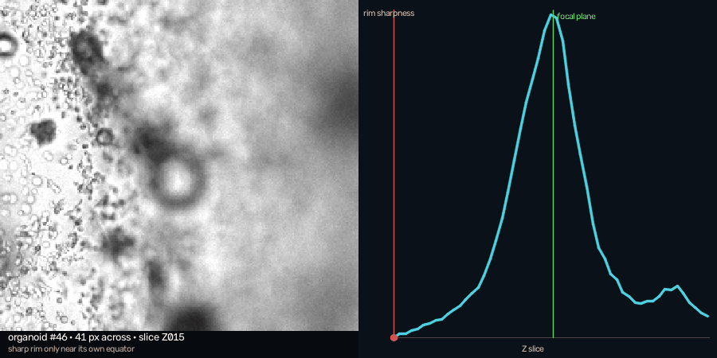
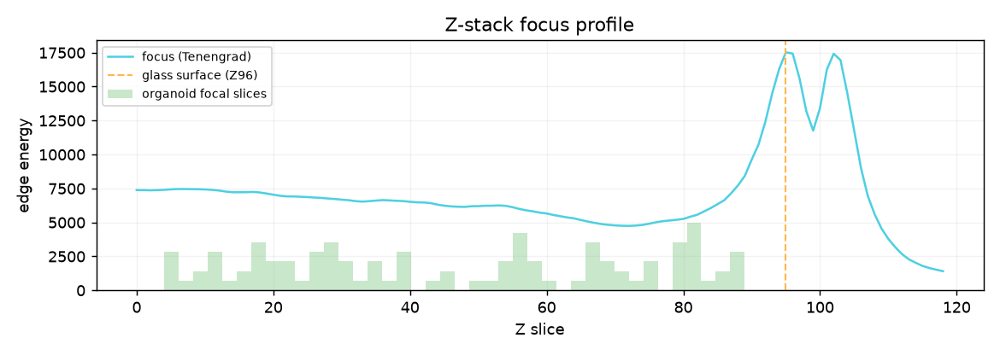
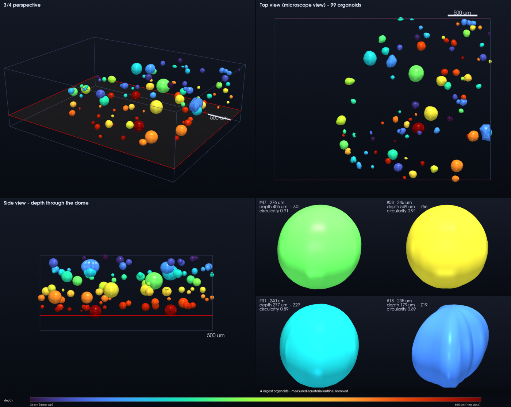
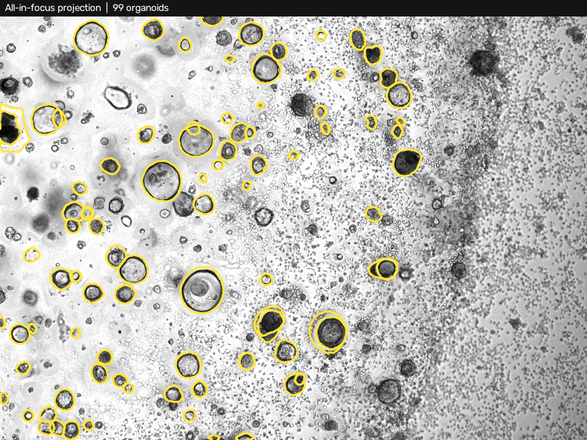
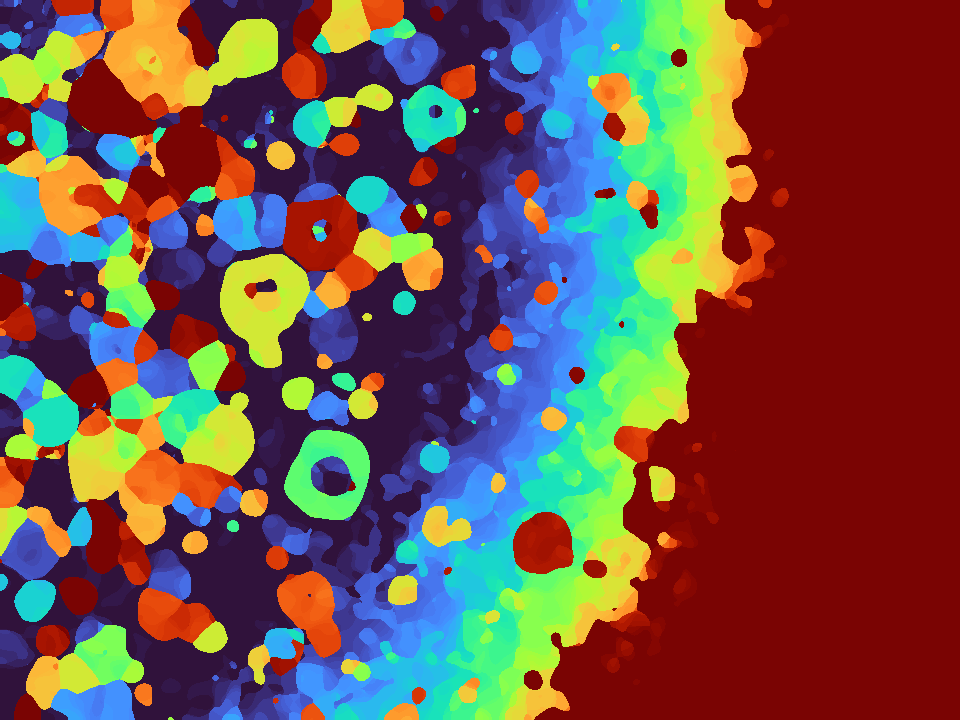

# JX-3D — 3D organoid reconstruction from brightfield Z-stacks

Measure organoids grown in a Matrigel dome from an ordinary **brightfield**
Z-stack — the kind a Keyence BZ-X produces by stepping the focus down through
the sample. No confocal, no fluorescence, no optical sectioning.

Output is a per-object feature matrix, a 3D mesh, and a single-file interactive
viewer that shows the reconstruction **on top of the raw photograph** so every
number can be checked by eye.

Measurements are reported in **pixels and slice indices**. Micrometres are added
only when a real calibration was recovered, and every calibrated value carries
the source it came from — see [Units](#units).


*Left: a raw slice with the reconstruction drawn on it — solid outlines are
organoids whose focal plane is this slice, faint ones are model cross-sections.
Right: the same slice placed at its own depth inside the 3D volume, with the
models clipped at that plane. Both panels move together as you scrub through Z.*


*99 organoids from one 119-slice stack, positioned and sized in micrometres.
Colour is depth in the dome; the orange outline is the glass surface.*

---

## Units

Every measurement is primarily in **pixels** (lateral) and **slice indices**
(axial), because that is what the image files actually contain. Micrometres are
emitted only when a scale was genuinely recovered — from the Keyence `.gci`, or
from `--px-size` / `--z-step-um` — and each one records its provenance:

```json
"units": {
  "primary": "pixels (lateral) and slice indices (axial)",
  "calibrated": true,
  "px_um": 3.7736,  "px_um_source": "keyence-lens-table",
  "z_um": 10.0,     "z_um_source": "keyence-stack-pitch",
  "anisotropy": 2.6499, "anisotropy_source": "calibration"
}
```

On an uncalibrated stack the micrometre columns are **absent**, not estimated,
and the pipeline says so on every run. A plausible-looking micrometre figure
derived from a guessed pixel size is worse than no figure at all, because
nothing downstream can tell the difference.

Volumes are given as `volume_voxels`, where one voxel is `1 px × 1 px × 1 slice`.

Note what the calibration sources mean here: the `.gci` records the *objective*,
not the pixel size, so `keyence-lens-table` is a lookup against Keyence's
documented BZ-X field of view — traceable, but not a measurement of this
particular instrument. Override it with `--px-size` if you have a stage
micrometer calibration.

---

## The problem this solves

It is tempting to treat a Z-stack as a 3D image and run a 3D segmenter on it.
For this modality that is simply wrong, and the failure is not subtle.

A PlanApo 4x / NA 0.20 objective has a **depth of field of ~35 µm**, while the
stack steps 10 µm at a time. No slice is an optical section: every frame is a
shadowgram of the *entire* dome. An organoid 300 µm above the focal plane still
casts a soft grey disc on it.

Threshold that volume in 3D and each organoid becomes a **column** stretching
through the whole stack. Connected-component labelling then fuses neighbours,
and the resulting "3D shapes" are artefacts of defocus, not biology.

What the stack does carry is **focus**. An organoid shows a crisp dark rim on
the slices near its own equator and a diffuse blur everywhere else. So the
question to ask is not

> is there signal at (x, y, z)?

but

> at which z is the rim at (x, y) sharpest?

That is *shape-from-focus*, and the whole pipeline is built on it.



*One organoid as the focus steps through it. The rim snaps into contrast over a
handful of slices and washes out again — and that peak, located to sub-slice
precision, is the organoid's equator. It is the only depth cue a brightfield
stack provides.*

| | |
|---|---|
|  | The stack's focus profile. The huge peak near Z096 is not biology — it is the **glass bottom of the well**, whose debris and Matrigel texture are sharper than anything alive. It is detected automatically and everything at or below it is excluded, otherwise focus peaks get dragged down onto the coverslip. |

---

## Results

Two Z-stacks from the same plate, 119 slices each, 960×720, 4x objective:

| | `4x_00009` | `4x_00001` |
|---|---|---|
| organoids | 99 | 71 |
| median diameter | 96 µm (IQR 67–127) | 71 µm |
| depth range | 36–885 µm | 83–855 µm |
| total volume | 0.109 µl | 0.036 µl |
| runtime, `--mode edf`, from scratch | ~30 s | **17 s** |



Colour is depth: blue near the top of the dome, red near the glass. The side
view is the interesting one biologically — these organoids are distributed
through the full 0.9 mm of dome rather than settled on the bottom.

The close-ups matter for reading what the reconstruction actually claims.
Organoid **#18 has circularity 0.69** and a visibly lobed surface: the bumps
around its equator are the genuinely measured `r(θ)` outline. The taper towards
the poles is the sphericity assumption, and nothing more.

---

## Why not just segment every slice

That was the first design, and it has a structural recall problem. An organoid
is crisply outlined only within ~3 slices of its focal plane, so the segmenter
gets exactly **one good look** at each object. Miss that look — faint rim, or a
neighbour's haze overlapping on that particular slice — and the organoid is lost
entirely.

On the all-in-focus projection every organoid shows its rim *at the same time*,
so the segmenter gets its best look at all of them at once. Measured on the same
data with the same parameters:

| detection mode | organoids found |
|---|---|
| per-slice + Z linking | 64 |
| all-in-focus projection | 99 |


*Building the all-in-focus projection. Left: raw slices, where most organoids
are blurred. Right: the projection accumulating the sharpest slice for every
pixel — by the end, every organoid shows a crisp rim simultaneously.*



*The recall check the pipeline writes on every run. On the projection every
organoid is sharp, so an un-outlined rim here is a genuine miss — unlike a
single raw slice, where most objects are legitimately out of focus. Most of what
is left unmarked sits in the dense Matrigel edge on the right, which is mainly
debris.*

The projection has its own blind spot: two organoids at the same (x, y) but
different depths merge into one blob. The per-slice path separates those. The
default `--mode both` takes the union of the two and deduplicates.



*Per-pixel depth of best focus — the by-product that makes the projection work.*

---

## The Matrigel dome

Organoids grow inside a droplet of gel sitting on the well bottom, and how far
each one sits from the droplet's outer surface is a real biological variable.
That surface is measurable, not assumed.

Where the curved gel/medium interface crosses the focal plane it refracts light
and leaves a broad, high-texture band. Because the surface is curved, the band
sits somewhere different on every slice — it moves outward as the focus descends
towards the glass, tracing the widening cross-section of the droplet. Collected
over all slices, those points lie *on* the dome surface, and a sphere is fitted
to them by RANSAC consensus followed by Huber-weighted refinement.

One detail matters more than it looks. The gel *ends* at the far side of the
texture band, not at its brightest point — near the edge you are looking through
a long slanted path of gel. Tracking the brightest point puts the surface inside
the droplet and leaves 23% of the organoids apparently outside the gel they grew
in. Tracking the band's outer edge encloses 99% of them:

| interface definition | fit residual | organoids enclosed |
|---|---|---|
| brightest point of the band | 5.6 px | 77% |
| **outer edge of the band** | **5.5 px** | **98.6%** |

The residual barely moves — both are good sphere fits — which is exactly why the
physical check is the one that decides. Every run validates the fit against it,
and **a dome that fails to enclose the organoids is rejected and no clearance
values are reported**, rather than shipping a confident-looking wrong surface.

`dome_distance_px` is then measured from each organoid's *surface*: zero means
touching the outside of the droplet, positive is inside the gel.

---

## Pipeline

```
1  load          calibration from the Keyence .gci, with provenance
2  focus profile edge energy per slice -> find the glass surface, exclude below it
2b dome          interface band traced on every slice -> sphere fit -> validated
                 against the organoids, rejected if it does not enclose them
3  EDF           sharpest slice per pixel -> all-in-focus image + depth map
4  detect        (a) one segmentation pass on the projection        [--mode edf]
                 (b) per-slice segmentation, consecutive slices linked
                     into 3D tracks by Hungarian assignment         [--mode slices]
                 default 'both': union of the two, deduplicated
5  focal planes  each outline's rim band is swept through Z; prominent peaks in
                 the sharpness curve are located to sub-slice precision by
                 parabolic interpolation -> the organoid's equatorial plane(s)
6  measure+mesh  the outline at that plane is the true widest cross-section;
                 r(θ) is revolved over a spheroidal profile to build the surface
7  viewer        raw image and model, side by side and superimposed
```

Segmentation uses **Cellpose-SAM** on GPU, or a classical edge + watershed
fallback (`--detector classical`) when that is unavailable.

### Why `do_3D` / `stitch_threshold` are not used

Cellpose's own 3D and slice-stitching modes assume consecutive slices are
genuinely different sections of an object. Here they are not — they are the same
object at different amounts of blur — so stitching happily fuses an organoid
with a neighbour's out-of-focus halo. Linking is done separately, with a focus
criterion Cellpose has no notion of.

### Why the reconstruction is model-based, not voxel-based

The stack carries no axial shape information: an organoid's rim looks the same
30 µm above its equator as 30 µm below. Three things *can* be measured reliably
— lateral position, the depth of the focal plane, and the full outline at that
depth. The reconstruction uses exactly those: the measured `r(θ)` contour swept
over a spheroidal profile. Non-circular organoids stay non-circular; the only
thing assumed in Z is near-sphericity, stated in `--axial-ratio` and adjustable.

Anything more would be inventing detail the microscope did not record.

---

## Install

Requires Python 3.12+, and a CUDA GPU for the Cellpose path (4 GB is enough;
developed on a GTX 1650 Ti).

```bash
python -m venv .venv
./.venv/bin/pip install -r requirements.txt
./.venv/bin/pip install cellpose        # optional; --detector classical works without it
```

## Run

### Control panel

```bash
./.venv/bin/python serve.py
```

Opens a local page where you browse to any Z-stack folder, set the parameters,
start the analysis, watch the log stream, and open the resulting viewer. Standard
library only — no server framework, nothing leaves the machine. Useful when you
want to run a new dataset in front of an audience rather than from a terminal.

### Command line

```bash
./.venv/bin/python run.py path/to/4x_00009 --open
```

```bash
# fastest: one segmentation pass on the projection (~30 s)
python run.py <folder> --mode edf

# most complete: projection + per-slice linking
python run.py <folder> --mode both

# no GPU / no cellpose
python run.py <folder> --detector classical

# more, but less trustworthy, objects
python run.py <folder> --min-sharpness 0.15

# smaller organoids
python run.py <folder> --min-diameter 20 --diameter 80

# measurements only, skip the 16 MB HTML
python run.py <folder> --no-viewer
```

Segmentation is cached per output folder, so re-running with different
reconstruction parameters takes seconds. `--no-cache` forces a re-segmentation.

Input is a folder of `*_Z###_*.tif` files plus, ideally, the Keyence `.gci`
group file next to it — that is where the calibration is read from.

---

## Output

| file | what |
|---|---|
| `viewer.html` | **single file**, double-click to open: raw image, interactive 3D, slicer, measurements |
| `qc_edf.png` | all-in-focus image + every outline — the recall check |
| `qc_slices.png` | raw slices + measured outlines — position and size check |
| `qc_focus.png` | focus profile, glass surface, organoid depth distribution |
| `edf.png`, `edf_depth.png` | all-in-focus projection and its depth map |
| `organoids.csv` | **per-object feature matrix**, one row per organoid |
| `outlines_px.csv` | the measured r(θ) contour, one row per organoid |
| `organoids.json` | same features plus calibration provenance and the dome fit |
| `organoids.ply` | colour-coded 3D mesh (MeshLab, Blender, ParaView) |
| `render_3d.png` | still renders, for when a browser is not available |

Still renders without a browser:

```bash
./.venv/bin/python render_3d.py output/4x_00009
```

### Feature matrix (`organoids.csv`)

One row per object. Pixel and slice columns are always present; the micrometre
block is appended only when the stack is calibrated.

| column | meaning |
|---|---|
| `oid` | object id, stable within a run |
| `source` | `edf` or `slices` — which detector found it |
| `x_px, y_px` | lateral position, pixels |
| `z_slice` | depth of the focal plane, fractional slice index |
| `best_slice` | integer slice the outline was measured on |
| `diameter_px`, `radius_px` | equivalent-circle size of the equatorial outline |
| `radius_z_slices` | axial semi-axis, in slices |
| `area_px2` | equatorial cross-section, px² |
| `volume_voxels` | ellipsoid volume; 1 voxel = 1 px × 1 px × 1 slice |
| `circularity` | 4πA/P² — 1.0 is a perfect circle |
| `focus_sharpness` | prominence of the focus peak, 0–1. **The quality measure**: low means the object has no real focal plane |
| `n_slices` | slices over which the rim stays at least half as sharp as at its peak |
| `dome_distance_px` | shortest gap from the organoid **surface** to the Matrigel interface. Positive = inside the gel. Empty if the dome fit was rejected |
| `dome_surface_slice` | slice index of the dome surface directly above the organoid |
| `x_um … volume_um3, dome_distance_um` | the same quantities in micrometres — **only when calibrated** |

`outlines_px.csv` carries the full measured contour: `oid` followed by 48 radii
in pixels, sampled at uniform angles from the object centre.

---

## Using the viewer

Three panes: raw microscope image, interactive 3D, measurements. The Z slider at
the bottom keeps them in sync.

**Slice mode** (`S`) clips away everything above the current plane, leaving the
organoid cross-sections sitting on the photograph that produced them. Drag the
slider: if the reconstruction is right, the cross-sections grow and shrink in
step with the rings sharpening and blurring in the image.

| key | |
|---|---|
| `← →` | one slice · `↑ ↓` ten slices |
| `space` | play through the stack |
| `S` | slice mode |
| `P` | photo plane on/off |
| `T` | top view — the microscope's own angle |
| `D` | fitted Matrigel dome surface on/off |
| `1 2 3` | side by side / 3D only / photo only |
| `O` | hide overlays, raw photo only |
| `F` | presentation mode |
| `Esc` | clear selection |

Clicking an organoid in either pane selects it in both.

### Presenting

`F` strips the page to the two viewports and the Z control, goes fullscreen, and
slows the auto-play to a speed that reads from a projector.

Three things were done for the sake of smoothness, because a stuttering demo is
worse than no demo:

* **Drawing is deferred to one animation frame.** Dragging the Z slider fires
  input events far faster than the canvas can repaint; coalescing them into a
  single frame is most of the difference.
* **The filtered object set and per-object colours are cached** and recomputed
  only when a filter or the colour mode actually changes, instead of on every
  frame.
* **Slices are decoded ahead of the playhead.** Decoding a 960×720 JPEG costs
  several milliseconds, so a slice first touched during playback arrives late.
  A window around the current slice is decoded in advance, and the
  **Preload slices** button decodes the whole stack up front — worth doing once
  before a talk, after which nothing hitches.

**Reading the outlines.** A solid coloured outline marks the slice where that
organoid was *measured* — if it does not sit on a crisp dark rim, that organoid
is wrong. A faint dashed outline is the model's cross-section at the current
slice; it shrinks and vanishes as you move away from the focal plane.

---

## Calibration

Read automatically from the `.gci` group file:

| | source | for the dataset above |
|---|---|---|
| µm/pixel | objective magnification + BZ-X field-of-view table | 3.774 |
| µm/slice | `<Stack><Pitch>`, stored in units of 0.1 µm | 10.0 |
| objective | `<Lens><LensName>` | PlanApo 4x, NA 0.20 |

If your setup differs, correct the `Acquisition` defaults in `jx3d/config.py`.
Every micrometre figure scales directly with these, so a wrong value makes every
measurement proportionally wrong.

---

## Known limits

* **Organoids whose focal plane lies outside the analysed range are not
  reported.** If the focus curve is still climbing when it reaches the edge of
  the search window, the true peak is above the top of the stack or down on the
  glass. Accepting the boundary value instead would pile those objects onto the
  last slice and report a depth the stack never recorded, so they are rejected.
* **Organoids sitting directly on the glass** are excluded along with the
  substrate margin, because they cannot be told apart from debris.
* **Axial shape is assumed, not measured** (`--axial-ratio`, spherical by
  default). Lateral shape is real; the Z profile is a model.
* Recall drops inside the dense Matrigel rim at the dome edge, where most of the
  small dark objects are debris anyway.

---

## Layout

```
jx3d/
  config.py       acquisition geometry (µm/px, µm/slice) and analysis parameters
  keyence.py      .gci metadata parsing
  stack.py        Z-stack loading
  focus.py        focus measures, substrate detection, focal-plane finding
  edf.py          all-in-focus projection + depth map
  detect.py       per-slice 2D segmentation (Cellpose-SAM / classical)
  link.py         Z linking of per-slice detections
  reconstruct.py  focal-plane measurement, spheroid meshing
  qc.py           quality-control figures
  viewer.py       self-contained HTML viewer
  viewer_template.html
run.py             CLI
render_3d.py       offline renders
make_docs_media.py figures for this README
```

## License

MIT
