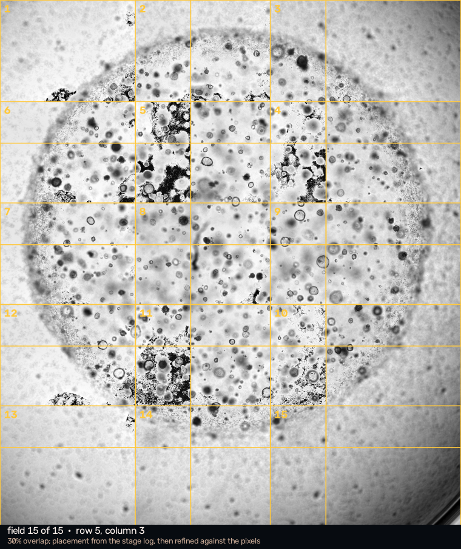
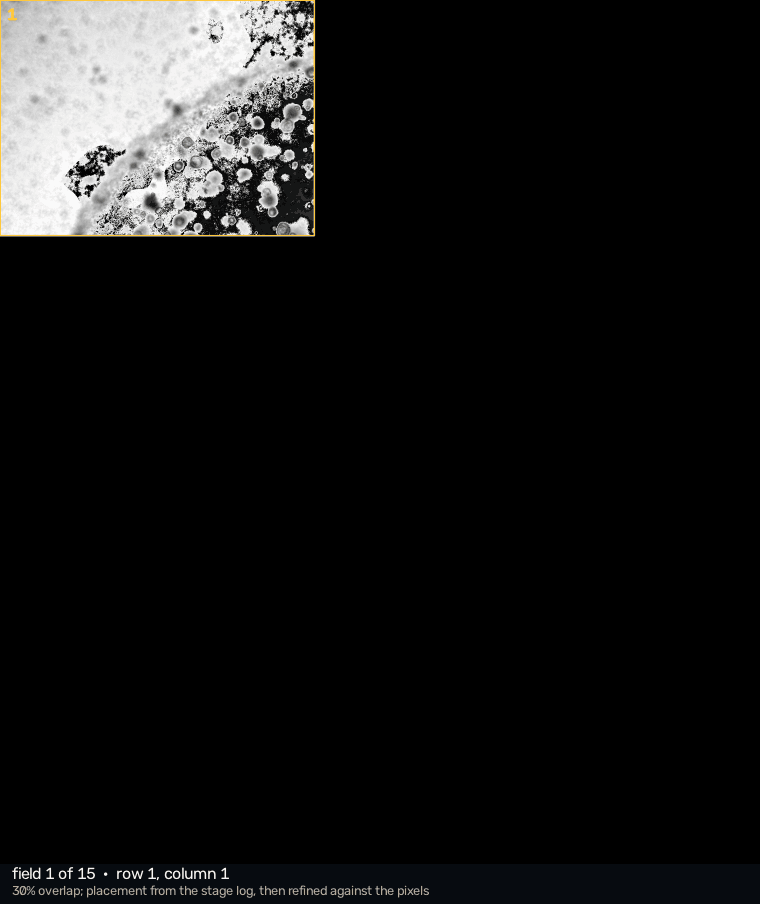
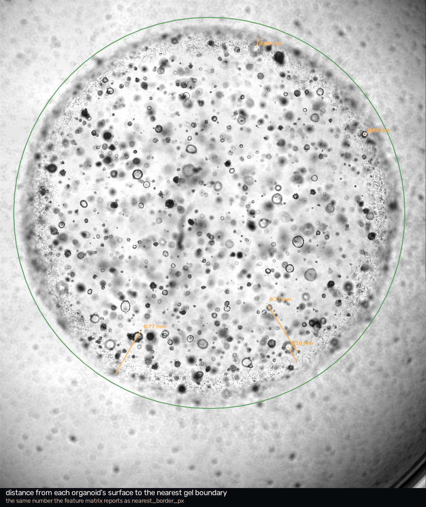
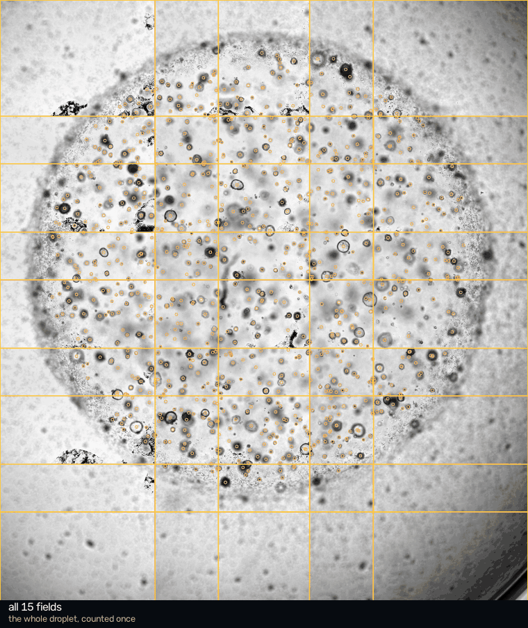

# JX-3D — 3D organoid reconstruction from brightfield Z-stacks

Measure organoids grown in a Matrigel dome from an ordinary **brightfield**
Z-stack — the kind a Keyence BZ-X produces by stepping the focus down through
the sample. No confocal, no fluorescence, no optical sectioning.

A dome is wider than one field of view, so it is captured as a grid of
overlapping stacks. JX-3D assembles those into a single frame and measures the
droplet as one object: [**the whole dome**](#the-whole-dome) covers that. For a
single field, everything below it still applies unchanged.

Output is a per-object feature matrix, a 3D mesh, and a single-file interactive
viewer that shows the reconstruction **on top of the raw photograph** so every
number can be checked by eye.

Measurements are reported in **pixels and slice indices**. Micrometres are added
only when a real calibration was recovered, and every calibrated value carries
the source it came from — see [Units](#units).



*One Matrigel droplet, 8 mm across, assembled from fifteen overlapping
brightfield Z-stacks. 844 organoids, each counted once and measured in a single
coordinate frame.*


*Left: a raw slice with the reconstruction drawn on it — solid outlines are
organoids whose focal plane is this slice, faint ones are model cross-sections.
Right: the same slice placed at its own depth inside the 3D volume, with the
models clipped at that plane. Both panels move together as you scrub through Z.*


*99 organoids from one 119-slice stack, positioned and sized in micrometres.
Colour is depth in the dome; the orange outline is the glass surface.*

---

## Units

Every measurement is primarily in **pixels** (lateral) and **slice indices**
(axial), because that is what the image files contain. Micrometres are emitted
only when a scale was genuinely recovered, and each one records its provenance:

```json
"units": {
  "primary": "pixels (lateral) and slice indices (axial)",
  "calibrated": true,
  "px_um": 3.7744,  "px_um_source": "keyence-calibration",
  "z_um": 10.0,     "z_um_source": "keyence-stack-pitch",
  "anisotropy": 2.6506, "anisotropy_source": "calibration"
}
```

On an uncalibrated stack the micrometre columns are **absent**, not estimated,
and the pipeline says so on every run. A plausible-looking micrometre figure
derived from a guessed pixel size is worse than no figure at all, because
nothing downstream can tell the difference.

Volumes are given as `volume_voxels`, where one voxel is `1 px × 1 px × 1 slice`.

### Where the scale actually comes from

Both numbers are worth justifying, because everything in micrometres depends on
them.

**Lateral scale — read from the instrument.** The `.gci` group file carries an
`Image/Calibration` field, stored the way Keyence stores every `System.Double`:
as the raw IEEE-754 bit pattern of the double, written out as a signed 64-bit
integer.

```python
>>> import struct
>>> struct.unpack("<d", struct.pack("<q", 4660518447848644499))[0]
3774.4179166666668          # nanometres per pixel -> 3.7744 µm/px
```

That decoding is not a guess. Two other fields in the same file are encoded the
same way *and* are also written in plain text in the objective's name,
`"PlanApo 4x 0.20/20.00mm"`:

| field | stored Int64 | decodes to | plain text in the lens name |
|---|---|---|---|
| `NumericalAperture` | 4596373779694328218 | **0.2** | `0.20` |
| `WorkingDistance` | 4626322717216342016 | **20.0** | `20.00mm` |
| `Calibration` | 4660518447848644499 | **3774.418** | — |

Two independent fields decode to exactly the values printed on the lens, so the
method is verified before it is applied to the one value that is not written
anywhere else.

As a further check, Keyence's documented field of view for a 4x objective on a
960 px wide frame gives 3.7736 µm/px — **0.02% from the instrument's own
figure**. The lookup table is kept only as a fallback for files with no
`Calibration` field, and when both are present the pipeline records the
disagreement in `organoids.json` (`calibration_vs_table_pct`).

**Axial scale — inferred, then cross-checked.** The Z pitch is stored as the
plain integer `<Stack><Pitch>100</Pitch>`, with no unit. Keyence's UI sets the
pitch in micrometres to one decimal place, so the natural reading is units of
0.1 µm, giving 10.0 µm per slice. That is an inference, so it is checked against
something physical: the fitted Matrigel droplet.

The dome fit gives a contact radius of 932 px and a height of 172 slices.
Turn that into a spherical-cap volume under each candidate unit:

| assumed pitch | droplet height | droplet volume |
|---|---|---|
| 1 µm/slice | 0.17 mm | 3.3 µL |
| **10 µm/slice** | **1.72 mm** | **36.0 µL** |
| 100 µm/slice | 17.16 mm | 2977.3 µL |

Matrigel domes are pipetted at roughly 20–50 µL. Only one of the three readings
produces a droplet that could exist in a well, and it is the one the encoding
already suggested. The pipeline prints this volume on every run precisely so the
axial scale keeps being challenged rather than assumed.

Note what is *not* a calibration: the TIFF `XResolution`/`YResolution` tags read
96 DPI, which is a screen-display placeholder written by the export, not a
spatial scale. They are ignored.

---

## The problem this solves

It is tempting to treat a Z-stack as a 3D image and run a 3D segmenter on it.
For this modality that is simply wrong, and the failure is not subtle.

A PlanApo 4x / NA 0.20 objective has a **depth of field of ~35 µm**, while the
stack steps 10 µm at a time. No slice is an optical section: every frame is a
shadowgram of the *entire* dome. An organoid 300 µm above the focal plane still
casts a soft grey disc on it.

Threshold that volume in 3D and each organoid becomes a **column** stretching
through the whole stack. Connected-component labelling then fuses neighbours,
and the resulting "3D shapes" are artefacts of defocus, not biology.

What the stack does carry is **focus**. An organoid shows a crisp dark rim on
the slices near its own equator and a diffuse blur everywhere else. So the
question to ask is not

> is there signal at (x, y, z)?

but

> at which z is the rim at (x, y) sharpest?

That is *shape-from-focus*, and the whole pipeline is built on it.


*One organoid as the focus steps through it. The rim snaps into contrast over a
handful of slices and washes out again — and that peak, located to sub-slice
precision, is the organoid's equator. It is the only depth cue a brightfield
stack provides.*

| | |
|---|---|
|  | The stack's focus profile. The huge peak near Z096 is not biology — it is the **glass bottom of the well**, whose debris and Matrigel texture are sharper than anything alive. It is detected automatically and everything at or below it is excluded, otherwise focus peaks get dragged down onto the coverslip. |

---

## Results

Two Z-stacks from the same plate, 119 slices each, 960×720, 4x objective:

| | `4x_00009` | `4x_00001` |
|---|---|---|
| organoids | 99 | 71 |
| median diameter | 96 µm (IQR 67–127) | 71 µm |
| depth range | 36–885 µm | 83–855 µm |
| total volume | 0.109 µl | 0.036 µl |
| runtime, `--mode edf`, from scratch | ~30 s | **17 s** |


Colour is depth: blue near the top of the dome, red near the glass. The side
view is the interesting one biologically — these organoids are distributed
through the full 0.9 mm of dome rather than settled on the bottom.

The close-ups matter for reading what the reconstruction actually claims.
Organoid **#18 has circularity 0.69** and a visibly lobed surface: the bumps
around its equator are the genuinely measured `r(θ)` outline. The taper towards
the poles is the sphericity assumption, and nothing more.

---

## Why not just segment every slice

That was the first design, and it has a structural recall problem. An organoid
is crisply outlined only within ~3 slices of its focal plane, so the segmenter
gets exactly **one good look** at each object. Miss that look — faint rim, or a
neighbour's haze overlapping on that particular slice — and the organoid is lost
entirely.

On the all-in-focus projection every organoid shows its rim *at the same time*,
so the segmenter gets its best look at all of them at once. Measured on the same
data with the same parameters:

| detection mode | organoids found |
|---|---|
| per-slice + Z linking | 64 |
| all-in-focus projection | 99 |


*Building the all-in-focus projection. Left: raw slices, where most organoids
are blurred. Right: the projection accumulating the sharpest slice for every
pixel — by the end, every organoid shows a crisp rim simultaneously.*


*The recall check the pipeline writes on every run. On the projection every
organoid is sharp, so an un-outlined rim here is a genuine miss — unlike a
single raw slice, where most objects are legitimately out of focus. Most of what
is left unmarked sits in the dense Matrigel edge on the right, which is mainly
debris.*

The projection has its own blind spot: two organoids at the same (x, y) but
different depths merge into one blob. The per-slice path separates those. The
default `--mode both` takes the union of the two and deduplicates.


*Per-pixel depth of best focus — the by-product that makes the projection work.*

---

## The whole dome

A Matrigel droplet is about 8 mm across and a 4x field is 3.6 mm, so no single
photograph contains the specimen. The microscope captures it as a grid of
overlapping Z-stacks — here 5 rows × 3 columns, 15 stacks of 119 slices — and
until those are placed in one coordinate frame there is no such thing as "this
organoid's distance to the edge of the dome", because the edge is in a different
file from the organoid.

```bash
./.venv/bin/python run_mosaic.py BK52_WT_9805_B
```



*The fifteen fields arriving in the order the stage visited them. The numbering
snakes along each row — 1‑2‑3, then 6‑5‑4, then 7‑8‑9 — which is the scan
pattern the group file records, not a convention chosen here.*

### Where the tiles go, and how we know

Nothing about the layout is declared in this code. The Keyence `.gci` states the
grid shape (`Row=5, Column=3`), its image list gives every stack its row and
column, and each TIFF carries the stage position it was taken at in a private
EXIF note. Offsets come from those positions, so an irregular scan would stay
irregular.

That gets the tiles roughly right and not exactly right. Correlating the
overlapping strips moves them by **up to 31 px — about 120 µm, three small
organoids** — which is more than enough to make one organoid look like two. The
fifteen positions are solved for at once against all twenty-two neighbour pairs
rather than chained from tile to tile, and the pairs then agree with each other
to **0.06 px**. That number is the warrant for trusting the assembled frame, and
the run refuses to proceed quietly without it.

Checking the geometry against the metadata would prove nothing, because the
group file and the stage log share a convention and would agree with each other
even if both were mirrored. So `tests/check_mosaic.py` asks the pixels instead:
overlapping tiles show the same specimen twice, and the placement has to beat its
own mirror image. It does, on all 22 pairs, by 3× to 26×.

One thing falls out of this that was not being looked for. The stage steps a
known distance and the images say how many pixels that was, so the mosaic
**measures the pixel size independently**: 3.7270 µm/px from the columns and
3.7263 from the rows, agreeing with each other to 0.02 % and with the
instrument's own calibration to 1.26 %. Two axes agreeing that closely means a
single scale factor rather than distortion. The test reports the disagreement
and does not resolve it — which of the two is right is not something the images
can settle.

### Illumination has to go first

Averaging all fifteen frames at one depth cancels the specimen and leaves the
optics. What is left is not a vignette but a smooth tilt of about **60 grey
levels** from one corner of the frame to the other, identical in every tile.

That matters more than it sounds. An organoid in an overlap zone lands at a
*different place in the frame* in each of the two tiles that see it, so without
correction the same object has two brightnesses and two textures depending on
which tile is asked. Since the feature matrix exists to measure appearance, this
is corrected before anything is measured: a per-pixel median over a hundred
frames, smoothed to the scale illumination actually varies on. It takes the
spread within a frame from 59 grey levels to **7.8**.

What is deliberately *not* removed is the difference in mean level between
tiles, which is nearly as large. That is specimen — the centre of the droplet is
dimmer because there is more gel to see through — and flattening it away would
delete signal.

### The glass is one plane, and two tiles cannot see it

Every tile was captured at the same stage Z, so the well bottom is physically one
plane with one right answer. Asking each tile separately does not give fifteen
noisy estimates of it; it gives thirteen good ones and two that are wrong.
`4x_00005` and `4x_00008` sit over the thickest gel, where the glass reflection
never becomes the sharpest thing in the field, and their focus profiles have no
peak worth the name — contrast 1.08 and 1.16 against 2.0 and up everywhere else.

Left to themselves they place the glass thirty slices too high and truncate
their own analysis through the densest part of the droplet. Supplying the
consensus plane instead takes `4x_00005` from **65 organoids to 128**. The
instrument's own recorded per-image focus score, which costs nothing and touches
no pixels, peaks at the same slice — an independent confirmation of the
consensus.

### The droplet, fitted to the droplet


*The gel/medium interface crossing each focal plane. It widens as the focus
descends, tracing the cross-section of a spherical cap — which is a figure only
the mosaic can produce, because in a single field the interface is a short arc
crossing one corner and nothing about it looks like a circle that grows.*

One field spans about a tenth of this dome, so fitting a 4 mm radius to it means
extrapolating from a short arc. That was not merely imprecise — it was biased.
The three per-field fits give contact radii of 932, 982 and 1020 px where the
whole mosaic gives **1066**, all three low, each quoting a bootstrap spread of a
quarter of a percent. The error bar was twenty times too small and pointed the
wrong way, and averaging fifteen such fits would have preserved the bias while
making the confidence look better.

Across fifteen tiles the entire footprint is inside the frame, so every azimuth
returns a rim and the contact circle stops being an extrapolation. Each slice
fits its own circle, which makes the axis a measurement with a real error bar —
sixteen slices agree on it to **2.6 px**, and unlike a bootstrap that comes from
genuinely separate observations. The cap then follows in closed form, because
r² + z² is linear in z for a sphere, and it explains the measured radii to
**3.0 px rms out of a 1226 px radius**.

The droplet: **8.0 mm across, 2.3 mm tall, 66 µl** — a volume someone could have
pipetted.

> **A check that had to be thrown away.** The `.gci` records four stage points
> the operator drove to when setting the scan up, and it is tempting to read them
> as their opinion of where the droplet ends. They are not. They sit a
> millimetre inside the fitted rim, their stage Z is the depth of slice 60 rather
> than of the glass, and the first tile centre lands 0.4 px from the first of
> them while the last overshoots by exactly the slack from rounding 1.97 columns
> up to 3 and 3.17 rows up to 5. They are the requested scan bounds. The test
> now asserts that they are *not* rim points, because using them would have been
> a confident, wrong validation.

### Counting each organoid once

Nearly half the mosaic is seen by more than one tile — 51 % of the canvas by
exactly one, 41 % by two and 8 % by four — so an organoid in an overlap is
detected twice, or at a corner up to four times.

Detection runs on each tile's own pixels and merging happens afterwards in mosaic
coordinates. The alternative, blending the tiles into one image and segmenting
that, fails on exactly what this project is for: a blend gives an organoid pixels
no camera recorded, weighted differently across the object, and a measurement
made on a blended pixel cannot be checked against a raw image because there is
none it came from.

Sightings are matched by an optimal one-to-one assignment per seam, gated on
lateral distance, depth and radius agreement. The axial gate is one depth of
field and no more — two organoids at the same (x, y) and different depths are an
ordinary configuration in a droplet a millimetre deep, and a loose gate would
fuse them and delete a real object.

When several views survive, **one is elected rather than averaged**. Averaging
two outlines produces a shape neither camera saw. The unelected views are kept in
`views.csv` instead of discarded, which turns the overlap into something better
than a nuisance: the same organoid measured twice, independently, is a free
repeatability estimate for every feature — an error bar a single field cannot
produce.

Clipping is detected geometrically, from how far an outline reaches towards its
frame edge, and never from shape. A disc cut clean in half still scores 0.72 for
circularity and sails through the 0.55 shape filter, so a shape test cannot see
clipping at all; it only sees a slightly rounder object.

On this dataset: **1306 sightings become 844 organoids**, so 35 % of raw
detections were repeats. Where two tiles agreed an object was there, they placed
it to a median of **0.39 px laterally and 0.58 slices in depth** — well inside
the 4 px and 3.3-slice gates, which is why the gates are not a sensitive knob.
348 organoids were seen by more than one tile and carry a second, independent
measurement of themselves.

Two numbers are reported rather than quietly fixed. 188 organoids sit in a
doubly-covered region but were found by only one of the two tiles; the other
tile's segmenter missing something does not make it unreal, so they are kept and
flagged. And the seam between the two central fields matched only a third of its
detections while placing those matches to half a pixel — the tiles are in the
right place, and the segmenter simply found different objects on either side of
it, which is what happens under the thickest gel. Reporting a low match rate as
a geometry failure would have been the wrong alarm.

The physical check that matters passes: **100 % of the organoids fall inside the
fitted droplet.** They grow in the gel, so anything else would have meant the
surface was wrong.

### Distance to the edge of the dome



*Each line runs from an organoid's surface to the nearest point on the gel
boundary — the quantity the feature matrix reports as `nearest_border_px`. In
the viewer it is a toggle.*

The clearance is measured from the organoid's **surface**, not its centre, so
zero means touching the boundary. Both boundaries are considered: the curved cap
above, and the circle where the gel meets the glass. For an organoid sitting low
and near the rim the contact circle is the closer one, and reporting only the cap
would overstate how sheltered it is.

---

## The Matrigel dome

Organoids grow inside a droplet of gel sitting on the well bottom, and how far
each one sits from the droplet's outer surface is a real biological variable.
That surface is measurable, not assumed.

Where the curved gel/medium interface crosses the focal plane it refracts light
and leaves a broad, high-texture band. Because the surface is curved, the band
sits somewhere different on every slice — it moves outward as the focus descends
towards the glass, tracing the widening cross-section of the droplet. Collected
over all slices, those points lie *on* the dome surface, and a sphere is fitted
to them by RANSAC consensus followed by Huber-weighted refinement.

Two details matter more than they look. The gel *ends* at the far side of the
texture band, not at its brightest point — near the edge you are looking through
a long slanted path of gel. Tracking the brightest point puts the surface inside
the droplet and leaves 23% of the organoids apparently outside the gel they grew
in. Tracking the band's outer edge encloses 99% of them:

| interface definition | fit residual | organoids enclosed |
|---|---|---|
| brightest point of the band | 5.6 px | 77% |
| **outer edge of the band** | **5.5 px** | **98.6%** |

The residual barely moves — both are good sphere fits — which is exactly why the
physical check is the one that decides.

The second detail is that "outer" has no fixed direction. Scanning every row
left-to-right, as this first did, quietly assumes the droplet edge lies to the
right; on a field where it enters from another side the scan returns debris
instead, and the fit is rejected. Each line is now scanned inward from both
ends, in rows and in columns, and the consensus fit keeps whichever set actually
lies on a sphere. Across the three fields in this dataset that yields droplets
of 55, 50 and 36 µL — mutually consistent, and consistent with the pipette. Every run validates the fit against it,
and **a dome that fails to enclose the organoids is rejected and no clearance
values are reported**, rather than shipping a confident-looking wrong surface.

`dome_distance_px` is then measured from each organoid's *surface*: zero means
touching the outside of the droplet, positive is inside the gel.

---

## Pipeline

```
1  load          calibration from the Keyence .gci, with provenance
2  focus profile edge energy per slice -> find the glass surface, exclude below it
2b dome          interface band traced on every slice -> sphere fit -> validated
                 against the organoids, rejected if it does not enclose them
3  EDF           sharpest slice per pixel -> all-in-focus image + depth map
4  detect        (a) one segmentation pass on the projection        [--mode edf]
                 (b) per-slice segmentation, consecutive slices linked
                     into 3D tracks by Hungarian assignment         [--mode slices]
                 default 'both': union of the two, deduplicated
5  focal planes  each outline's rim band is swept through Z; prominent peaks in
                 the sharpness curve are located to sub-slice precision by
                 parabolic interpolation -> the organoid's equatorial plane(s)
6  measure+mesh  the outline at that plane is the true widest cross-section;
                 r(θ) is revolved over a spheroidal profile to build the surface
7  viewer        raw image and model, side by side and superimposed
```

Segmentation uses **Cellpose-SAM** on GPU, or a classical edge + watershed
fallback (`--detector classical`) when that is unavailable.

### Why `do_3D` / `stitch_threshold` are not used

Cellpose's own 3D and slice-stitching modes assume consecutive slices are
genuinely different sections of an object. Here they are not — they are the same
object at different amounts of blur — so stitching happily fuses an organoid
with a neighbour's out-of-focus halo. Linking is done separately, with a focus
criterion Cellpose has no notion of.

### Why the reconstruction is model-based, not voxel-based

The stack carries no axial shape information: an organoid's rim looks the same
30 µm above its equator as 30 µm below. Three things *can* be measured reliably
— lateral position, the depth of the focal plane, and the full outline at that
depth. The reconstruction uses exactly those: the measured `r(θ)` contour swept
over a spheroidal profile. Non-circular organoids stay non-circular; the only
thing assumed in Z is near-sphericity, stated in `--axial-ratio` and adjustable.

Anything more would be inventing detail the microscope did not record.

---

## Install

Requires Python 3.12+, and a CUDA GPU for the Cellpose path (4 GB is enough;
developed on a GTX 1650 Ti).

```bash
python -m venv .venv
./.venv/bin/pip install -r requirements.txt
./.venv/bin/pip install cellpose        # optional; --detector classical works without it
```

## Run

### Whole dome

```bash
./.venv/bin/python run_mosaic.py BK52_WT_9805_B
```

About two minutes on a GTX 1650 Ti for fifteen fields in `--mode edf`, and the
per-field results are cached, so re-running to change only the feature
extraction does not re-segment anything. Peak memory is one tile at a time
(~90 MB); the assembled volume would be 750 million voxels and is never held.

### Control panel

```bash
./.venv/bin/python serve.py
```

Opens a local page where you browse to any Z-stack folder, set the parameters,
start the analysis, watch the log stream, and open the resulting viewer. Standard
library only — no server framework, nothing leaves the machine. Useful when you
want to run a new dataset in front of an audience rather than from a terminal.

### Command line

```bash
./.venv/bin/python run.py                 # nearest 4x_00009, or the first stack found
./.venv/bin/python run.py --menu          # list what is here and pick one
./.venv/bin/python run.py path/to/stack   # a specific folder
```

With no folder argument it looks for a Z-stack below the current directory,
preferring one named `4x_00009` — the position in the reference dataset whose
organoids span the full depth of the dome — and otherwise taking the first one
it finds, so it still does something sensible on data it has never seen.
`--list` prints the candidates without running anything.

```bash
# fastest: one segmentation pass on the projection (~30 s)
python run.py <folder> --mode edf

# most complete: projection + per-slice linking
python run.py <folder> --mode both

# no GPU / no cellpose
python run.py <folder> --detector classical

# more, but less trustworthy, objects
python run.py <folder> --min-sharpness 0.15

# smaller organoids
python run.py <folder> --min-diameter 20 --diameter 80

# measurements only, skip the 16 MB HTML
python run.py <folder> --no-viewer
```

Segmentation is cached per output folder, so re-running with different
reconstruction parameters takes seconds. `--no-cache` forces a re-segmentation.

Input is a folder of `*_Z###_*.tif` files plus, ideally, the Keyence `.gci`
group file next to it — that is where the calibration is read from.

---

## Output

A whole-dome run (`run_mosaic.py`) writes:

| file | what |
|---|---|
| `features.csv` | **the feature matrix** — one row per organoid, 139 columns |
| `views.csv` | every sighting, including the ones not elected; a repeat measurement of the same organoid is an error bar, not a discard |
| `viewer.html` | **single file**, ~22 MB: the whole stack, all fifteen fields switchable, with the feature table |
| `mosaic.json` | tile geometry, registration residuals, dome fit, merge report, provenance |
| `tiles.json` | where each tile sits and where that placement came from |
| `tiles/<name>/` | each field's own measurement, exactly as the single-field pipeline writes it |

A single-field run (`run.py`) writes:

| file | what |
|---|---|
| `viewer.html` | **single file**, double-click to open: raw image, interactive 3D, slicer, measurements |
| `qc_edf.png` | all-in-focus image + every outline — the recall check |
| `qc_slices.png` | raw slices + measured outlines — position and size check |
| `qc_focus.png` | focus profile, glass surface, organoid depth distribution |
| `edf.png`, `edf_depth.png` | all-in-focus projection and its depth map |
| `organoids.csv` | **per-object feature matrix**, one row per organoid |
| `outlines_px.csv` | the measured r(θ) contour, one row per organoid |
| `organoids.json` | same features plus calibration provenance and the dome fit |
| `organoids.ply` | colour-coded 3D mesh (MeshLab, Blender, ParaView) |
| `render_3d.png` | still renders, for when a browser is not available |

Still renders without a browser:

```bash
./.venv/bin/python render_3d.py output/4x_00009
```

### Whole-dome feature matrix (`features.csv`)

844 organoids × 139 columns on this dataset. The blocks, and what each is for:

| block | columns | what it carries |
|---|---|---|
| identity | `uid`, `tile`, `tile_row/col`, `views`, `n_views`, `coverage_k` | which field each measurement came from, and how many saw it |
| flags | `clipped`, `clipped_everywhere`, `single_view_in_overlap`, `radius_disagreement`, `guarantee_void` | when a row should be distrusted, and why |
| position | `x/y_mosaic_px`, `z_slice`, `dome_radial_px`, `dome_azimuth_deg`, `height_above_glass_slices` | where in the droplet, in one shared frame |
| dome border | `nearest_border_px`, `dome_distance_px`, `contact_edge_distance_px`, `nearest_border_is_cap` | clearance from the organoid's **surface** to the gel boundary |
| size | `diameter_px`, `area_px2`, `volume_voxels`, `radius_z_slices` | measured laterally; the axial extent is **modelled** |
| shape | `circularity`, `solidity`, `convexity`, `radius_cv`, `harmonic_1..6` | rotation-invariant outline descriptors from r(θ) |
| core vs rim | `rim_minus_core_od`, `core_rim_separation`, `core_fill_fraction`, `core_od_*`, `rim_od_*` | **the viability construct** |
| texture | `core_glcm_*` (5 properties × 3 distances), `core_lbp_*`, `core_grad_mean` | granularity of the lumen |
| focus | `focus_sharpness`, `n_slices`, `best_slice` | how convincingly the rim came into focus |
| neighbours | `nn_distance_px`, `nn_gap_px`, `n_within_5r` | local crowding |
| quality | `appearance_measurable`, `background_dn`, `background_tilt_frac`, `background_clipped_frac` | whether the appearance block can be believed at all |

**No raw intensity is reported.** Brightfield is illumination × transmittance, so
every intensity column is an optical density measured against a background
estimated from a ring around *that* organoid. Otherwise a model would learn
which tile a row came from — the illumination varies 60 grey levels across a
frame and 90 between tiles, and the same organoid in an overlap falls at
different places in the two frames that see it.

**Core versus rim is the biologically motivated feature.** A live cystic organoid
is a fluid-filled sphere: a thin refractile shell around an optically empty
lumen, so its centre is bright and smooth and its rim is a dark ring. As it dies
the lumen fills with debris, the centre darkens and goes granular, and the
contrast collapses. `rim_minus_core_od` measures exactly that difference, and on
this dataset it is genuinely two-sided — 45 % of organoids have a denser rim than
core — rather than a constant sign.

> The measurement band lies **inside** the outline, not straddling it. A band
> centred on the boundary is half background, and background is the brightest
> thing in a transmitted-light image, so it dragged rim density towards zero and
> made every organoid look denser in the middle than at the edge. That was an
> artefact of where the band was drawn, not a property of the organoids.

`background_clipped_frac` deserves attention. The transmitted-light background
saturates at 255 over much of this dataset — it is the *mode* in nine of the
fifteen tiles — so where it clips the background level is a lower bound rather
than a measurement, and any density derived from it should be read with that
column beside it.

Columns whose value depends on the near-spherical assumption rather than on
anything the microscope recorded are named so that this is visible without
reading the documentation.

### Single-field feature matrix (`organoids.csv`)

One row per object. Pixel and slice columns are always present; the micrometre
block is appended only when the stack is calibrated.

| column | meaning |
|---|---|
| `oid` | object id, stable within a run |
| `source` | `edf` or `slices` — which detector found it |
| `x_px, y_px` | lateral position, pixels |
| `z_slice` | depth of the focal plane, fractional slice index |
| `best_slice` | integer slice the outline was measured on |
| `diameter_px`, `radius_px` | equivalent-circle size of the equatorial outline |
| `radius_z_slices` | axial semi-axis, in slices |
| `area_px2` | equatorial cross-section, px² |
| `volume_voxels` | ellipsoid volume; 1 voxel = 1 px × 1 px × 1 slice |
| `circularity` | 4πA/P² — 1.0 is a perfect circle |
| `focus_sharpness` | prominence of the focus peak, 0–1. **The quality measure**: low means the object has no real focal plane |
| `n_slices` | slices over which the rim stays at least half as sharp as at its peak |
| `dome_distance_px` | shortest gap from the organoid **surface** to the Matrigel interface. Positive = inside the gel. Empty if the dome fit was rejected |
| `dome_surface_slice` | slice index of the dome surface directly above the organoid |
| `x_um … volume_um3, dome_distance_um` | the same quantities in micrometres — **only when calibrated** |

`outlines_px.csv` carries the full measured contour: `oid` followed by 48 radii
in pixels, sampled at uniform angles from the object centre.

---

## Using the whole-dome viewer

Photograph on the left, 3D on the right, and a 5×3 map of the acquisition on the
side — the same grid the fields were captured on, so the control mirrors the
specimen rather than an arbitrary list.



*Click a cell to toggle that field, shift-click for it alone. Both panes follow:
switched-off fields dim in the photograph and their organoids disappear from the
3D scene.*

Because the sightings were merged, an organoid seen by two fields is **one**
organoid with one row, and switching on both of its fields does not draw it
twice. The `views` column names every field that saw it.

### Stepping through depth

The viewer opens on the **raw stack**, not on a projection, and the slider steps
one slice at a time — arrow keys, the ◀ ▶ buttons, or Play. Both panes move
together: the photograph changes, the plane floating inside the 3D volume moves
to that depth, and the reconstruction is clipped at it, so the models are cut
where the photograph cuts them.

That matters more than convenience. A Z-stack whose depth you cannot step
through is not a Z-stack, and depth is the one thing this modality measures.
Watching each organoid sharpen at its own plane and blur again *is* the evidence
that the depths in the feature matrix are real.

Outlines drawn on the photograph are the **measured r(θ) contour**, not a
stand-in circle, and organoids whose focal plane lies within the depth window of
the current slice are drawn solid while the rest stay faint — so the
superposition says which organoids this particular photograph is evidence for.
The outline strength, the fill, and the depth window are all adjustable, and
**All depths** turns the distinction off.

Switch to **All-in-focus** for the projection instead: the sharpest pixel over
depth, every organoid crisp at once. Select a single field and you get that
field's own projection.

Field borders and field numbers are toggles, and off by default for the numbers.

Clicking any organoid, in either pane, fills the feature table with all 139
columns grouped by block, with the quality flags at the top. **Border line**
draws the shortest path from that organoid's surface to the gel boundary, in
both panes. The dome is drawn as a translucent cap with latitude rings — the
same cross-sections the fit was made from — plus the contact circle at the
glass.

**Navigation.** Left-drag orbits, right-drag or shift-drag pans, the wheel
zooms; `R` resets and `T` looks straight down. Elevation stops just short of
vertical, because at the pole the view direction is parallel to the up vector
and the scene snaps to an arbitrary roll.

The whole thing is a single file with no server and no network access, about
22 MB. Every slice of every field would have been 222 MB, so what is embedded is
the assembled mosaic stack — all 91 analysed slices, flat-fielded, at 850 px —
plus the sixteen projections.

## Using the single-field viewer

Three panes: raw microscope image, interactive 3D, measurements. The Z slider at
the bottom keeps them in sync.

**Slice mode** (`S`) clips away everything above the current plane, leaving the
organoid cross-sections sitting on the photograph that produced them. Drag the
slider: if the reconstruction is right, the cross-sections grow and shrink in
step with the rings sharpening and blurring in the image.

| key | |
|---|---|
| `← →` | one slice · `↑ ↓` ten slices |
| `space` | play through the stack |
| `S` | slice mode |
| `P` | photo plane on/off |
| `T` | top view — the microscope's own angle |
| `D` | fitted Matrigel dome surface on/off |
| `1 2 3` | side by side / 3D only / photo only |
| `O` | hide overlays, raw photo only |
| `F` | presentation mode |
| `Esc` | clear selection |

Clicking an organoid in either pane selects it in both.

### Presenting

`F` strips the page to the two viewports and the Z control, goes fullscreen, and
slows the auto-play to a speed that reads from a projector.

Three things were done for the sake of smoothness, because a stuttering demo is
worse than no demo:

* **Drawing is deferred to one animation frame.** Dragging the Z slider fires
  input events far faster than the canvas can repaint; coalescing them into a
  single frame is most of the difference.
* **The filtered object set and per-object colours are cached** and recomputed
  only when a filter or the colour mode actually changes, instead of on every
  frame.
* **Slices are decoded ahead of the playhead.** Decoding a 960×720 JPEG costs
  several milliseconds, so a slice first touched during playback arrives late.
  A window around the current slice is decoded in advance, and the
  **Preload slices** button decodes the whole stack up front — worth doing once
  before a talk, after which nothing hitches.

**Reading the outlines.** A solid coloured outline marks the slice where that
organoid was *measured* — if it does not sit on a crisp dark rim, that organoid
is wrong. A faint dashed outline is the model's cross-section at the current
slice; it shrinks and vanishes as you move away from the focal plane.

---

## Calibration

Read automatically from the `.gci` group file:

| | source | for the dataset above |
|---|---|---|
| µm/pixel | objective magnification + BZ-X field-of-view table | 3.774 |
| µm/slice | `<Stack><Pitch>`, stored in units of 0.1 µm | 10.0 |
| objective | `<Lens><LensName>` | PlanApo 4x, NA 0.20 |

If your setup differs, correct the `Acquisition` defaults in `jx3d/config.py`.
Every micrometre figure scales directly with these, so a wrong value makes every
measurement proportionally wrong.

---

## Known limits

* **Organoids whose focal plane lies outside the analysed range are not
  reported.** If the focus curve is still climbing when it reaches the edge of
  the search window, the true peak is above the top of the stack or down on the
  glass. Accepting the boundary value instead would pile those objects onto the
  last slice and report a depth the stack never recorded, so they are rejected.
* **Organoids sitting directly on the glass** are excluded along with the
  substrate margin, because they cannot be told apart from debris.
* **Axial shape is assumed, not measured** (`--axial-ratio`, spherical by
  default). Lateral shape is real; the Z profile is a model.
* Recall drops inside the dense Matrigel rim at the dome edge, where most of the
  small dark objects are debris anyway.

---

## Checking the viewer

```bash
./.venv/bin/python tests/check_viewer.py output/4x_00009/viewer.html
```

Loads the generated page in headless Firefox, synthesises the interactions and
asserts on the result. It exists because the viewer's worst faults were
invisible to every other kind of check: the 3D view moved the camera but never
requested a repaint, and switching layouts left each canvas' backing store out
of step with its element. Both versions parsed cleanly and passed a syntax and
reference check; neither fault could be seen without running the page.

One thing to know if you extend it: headless Firefox screenshots do not capture
a WebGL canvas — it comes out black even while the scene renders correctly — so
the harness reads the framebuffer back with `gl.readPixels` rather than trusting
the picture.

---

## Layout

```
jx3d/
  config.py         acquisition geometry (µm/px, µm/slice) and analysis parameters
  keyence.py        .gci metadata: calibration, tile layout, per-frame stage position
  stack.py          Z-stack loading
  focus.py          focus measures, substrate detection, focal-plane finding
  edf.py            all-in-focus projection + depth map
  detect.py         per-slice 2D segmentation (Cellpose-SAM / classical)
  link.py           Z linking of per-slice detections
  reconstruct.py    focal-plane measurement, spheroid meshing
  dome.py           spherical-cap fit for one field
  qc.py             quality-control figures
  viewer.py         self-contained HTML viewer (single field)
  viewer_template.html
  --- whole dome ---
  mosaic.py         where each tile sits, and the provenance of that placement
  register.py       refining the offsets against the overlapping pixels
  blend.py          flat-field estimation; composited slices, for display only
  dome_global.py    one droplet fitted across all fifteen fields
  dedup.py          fifteen lists of sightings into one catalogue of organoids
  features.py       appearance: regions, optical density, shape, texture, space
  mosaic_pipeline.py  the staged run
  viewer_mosaic.py  the fifteen-field viewer
  mosaic_viewer.html
run.py               CLI, one field
run_mosaic.py        CLI, whole dome
serve.py             browser control panel
render_3d.py         offline renders
make_docs_media.py   single-field figures for this README
make_mosaic_media.py whole-dome figures for this README
tests/check_viewer.py         browser check of the single-field viewer
tests/check_mosaic_viewer.py  browser check of the whole-dome viewer
tests/check_mosaic.py         tile geometry, against the pixels
tests/check_dome.py           the global dome fit
```

### Checking a whole-dome run

```bash
./.venv/bin/python tests/check_mosaic.py BK52_WT_9805_B
./.venv/bin/python tests/check_dome.py BK52_WT_9805_B
./.venv/bin/python tests/check_mosaic_viewer.py \
    output/BK52_WT_9805_B_mosaic/viewer.html
```

Each prints one `PASS`/`FAIL` line per claim and exits non-zero on any failure.
The checks that matter most are the ones that leave the metadata behind and ask
the pixels: that the tile placement beats its own mirror image, that the fitted
rim tracks the texture ridge in the raw image, and that switching a field off in
the viewer actually removes its organoids from both panes.

## License

MIT
